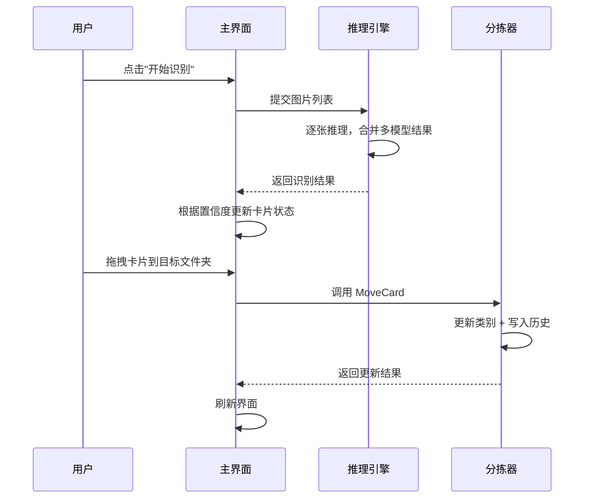

# Animals 项目实践案例

> 本文通过 AnimalsDesktop 项目的真实经历，说明 InspireSpec 方法论如何解决"有设计稿但缺工程规格"导致的典型问题。
>
> 重点不是项目做了什么，而是方法论在每个环节解决了什么。

---

## 1. 起始状况

Animals 项目已经完成了 InspireDesign 阶段的全部产物：

- 功能设计文档
- 技术架构文档
- UI 规范与界面详细设计
- 设计令牌与组件库
- HTML 原型页
- 技术映射表

从"设计资产"角度看，文档齐全、界面清晰。

但进入编码阶段后，仍然反复出现问题——**设计稿能指导 UI 长什么样，但无法指导代码该怎么写。**

这正是 InspireSpec 要介入的位置。

---

## 2. 暴露的问题与根因

编码后暴露了 10 个 Bug，按根因归类：

| 根因类型 | 占比 | 典型表现 |
|---------|------|---------|
| 字段语义未裁定 | 30% | "低置信度"到底算识别成功还是识别失败？设计稿没有给出明确定义，开发者按各自理解实现，导致 `passed=true` 但用户看到的是"未识别" |
| 交互规格缺失 | 40% | 设计稿画了勾选标记、键盘快捷键、拖拽改类，但没有写成可执行的条件和状态流转，实现时逐项遗漏 |
| 模块协作未定义 | 20% | 拖拽改类只有"接收端"没有"发起端"，因为设计稿没有定义模块之间的调用契约 |
| 边界条件未处理 | 10% | 拖拽到文件夹时类别设为空，因为没有人追问过"拖到非叶子节点怎么办" |

**核心发现**：这些问题不是"设计没画"，而是"设计画了但不够精确"。UI 设计能表达视觉和交互意图，但无法表达：

- 字段的精确语义
- 跨模块的调用契约
- 状态流转的完整条件
- 边界情况的处理规则

这些恰好是工程规格层的职责。

---

## 3. 方法论如何逐个解决问题

### 问题一：字段语义靠猜

**现象**：`passed` 字段在代码中有两种理解——"模型输出了结果"和"结果达到置信度阈值"。

**方法论介入**：用 PRD 模板定义验收标准，用数据字典模板定义每个字段的精确语义。

```
PRD 要求：明确"识别通过"的业务定义
数据字典要求：passed = 最高置信度模型的结果 >= 阈值
通用约束要求：低于阈值时统一归入"识别无"，不允许 passed=true 但显示"未识别"
```

**解决效果**：字段语义从"靠猜"变成"查表"，开发者不需要再问产品经理。

**对应模板**：
- [PRD产品需求模板](../templates/PRD产品需求模板.md)
- [数据字典模板](../templates/数据字典模板.md)
- [通用约束与业务规则模板](../templates/通用约束与业务规则模板.md)

---

### 问题二：通用约束散落各处

**现象**：置信度阈值、多模型合并规则、缓存失效策略分散在不同代码文件中，修改一处漏掉另一处。

**方法论介入**：用通用约束模板把所有跨模块规则集中到一个文档，每条规则有编号、等级、影响范围。

```
R-INF-01: 置信度阈值默认 0.60，可由用户调整
R-INF-02: 多模型结果按置信度降序合并
R-CACHE-01: 缓存键必须绑定模型版本
```

**解决效果**：规则从"散落"变成"集中"，新增模块时只需查约束表，不需要翻遍所有代码。

**对应模板**：
- [通用约束与业务规则模板](../templates/通用约束与业务规则模板.md)

---

### 问题三：模块协作靠口头约定

**现象**：拖拽改类功能只实现了"接收端"（目标文件夹接收新类别），没有"发起端"（源卡片更新类别和状态），因为两个模块的开发者对"谁调用谁、传什么参数"没有共识。

**方法论介入**：用接口契约模板定义每个模块的输入、输出、副作用、异常处理。

```
接口：Sorter.MoveCard(cardId, targetFolder)
输入：cardId（必填）、targetFolder（必填）
输出：更新后的 ResultRecord
副作用：1) 更新卡片类别 2) 写入分拣历史 3) 刷新目标文件夹计数
异常：targetFolder 不存在 → 返回错误码，不修改任何状态
```

**解决效果**：并行开发时不再需要口头对齐，契约文档就是联调依据。

**对应模板**：
- [接口契约模板](../templates/接口契约模板.md)

---

### 问题四：只有模块图，没有流程图

**现象**：架构文档画了模块分层，但没有画"登录 → 扫描 → 识别 → 合并 → 分拣"的完整时序。开发者各自理解流程顺序，导致状态更新时序错乱。

**方法论介入**：用核心流程时序图模板，用 Mermaid sequenceDiagram 表达关键流程。



**解决效果**：流程从"各自理解"变成"共同参照"，状态时序问题在编码前就被发现。

**对应模板**：
- [核心流程时序图模板](../templates/核心流程时序图模板.md)

---

### 问题五：架构只画了分层，没画运行和部署

**现象**：知道有"中心服务"和"边缘服务"，但不知道它们之间的通信协议、断网策略、数据同步方式。

**方法论介入**：用 4+1 视图模板补齐进程视图（运行时通信）和物理视图（部署拓扑）。

**解决效果**：部署和运维不再靠"到现场再决定"。

**对应模板**：
- [架构4+1视图模板](../templates/架构4+1视图模板.md)

---

### 问题六：修复引入回归

**现象**：修复 Bug 1（低置信度语义）时，导致 Bug 8（低置信状态显示丢失），因为没有人追踪"改了这个逻辑，哪些地方会受影响"。

**方法论介入**：用需求追踪矩阵（RTM）建立 需求 → 设计 → 代码 → 测试 的双向映射。

```
PRD-F03 "低置信度处理"
  → 通用约束 R-INF-01
  → ImageProcessor.cs 第 120-145 行
  → 测试用例 TC-03-正常 / TC-03-边界 / TC-03-异常
```

**解决效果**：修改任何逻辑时，先查 RTM 找到所有关联点，避免回归。

**对应模板**：
- [需求追踪矩阵模板](../templates/需求追踪矩阵模板.md)

---

## 4. 方法论反哺：这个案例让 InspireSpec 增加了什么

Animals 项目的实践不仅验证了方法论，还反向推动了模板体系的完善：

| 从实践中发现的需要 | InspireSpec 新增/增强的产物 |
|------------------|--------------------------|
| 设计稿不能直接指导编码 | 新增 PRD 模板，明确"设计到规格"的翻译过程 |
| 字段语义靠猜 | 强化数据字典模板的"字段语义"列 |
| 跨模块规则散落 | 新增通用约束模板 |
| 模块协作不清 | 新增接口契约模板 |
| 只有模块图没有流程图 | 新增核心流程时序图模板 |
| 部署靠现场决定 | 新增硬件与部署清单模板 |
| 修复引发回归 | 强化 RTM 模板的"代码位置"和"测试用例"列 |
| 低置信度语义误导 | 修正模板中的中性表达，避免项目特定裁定污染通用模板 |

---

## 5. 可复用结论

从 Animals 项目提炼出以下通用经验：

### 5.1 设计稿 ≠ 工程规格

UI 设计能表达"长什么样"和"怎么交互"，但无法表达：
- 字段的精确语义
- 跨模块的调用契约
- 状态流转的完整条件
- 边界情况的处理规则

这些必须由工程规格层补齐。

### 5.2 70% 的 Bug 来自"设计与实现的不一致"

这不是"开发者不认真"的问题，而是"设计稿不够精确"的问题。工程规格层的作用就是把模糊地带变成明确约束。

### 5.3 通用约束必须集中管理

散落在代码各处的规则，修改时必然遗漏。集中到一个文档、给每条规则编号，是最低成本的防范措施。

### 5.4 时序图比模块图更能暴露问题

模块图告诉你"有哪些部件"，时序图告诉你"部件怎么配合"。大多数集成问题出在后者。

### 5.5 RTM 不是形式主义，是回归防护网

没有追踪矩阵时，每次修改都是"盲改"。有了 RTM，修改前可以先查影响范围。

---

## 6. 对读者的建议

如果你正在一个"有设计稿但缺工程规格"的项目中：

1. **先写 PRD**：把"做到什么程度算完成"定义清楚
2. **再建数据字典**：把字段语义统一，消除"靠猜"
3. **集中通用约束**：把跨模块规则收拢到一个文档
4. **补接口契约**：让并行开发有据可依
5. **画时序图**：暴露模块协作中的隐含假设
6. **建 RTM**：让每次修改都有迹可循

不需要一次做完。按 [05-快速上手指南](../docs/05-快速上手指南.md) 的最小可行规格路径，从 PRD + 数据字典 + 通用约束 开始即可。
