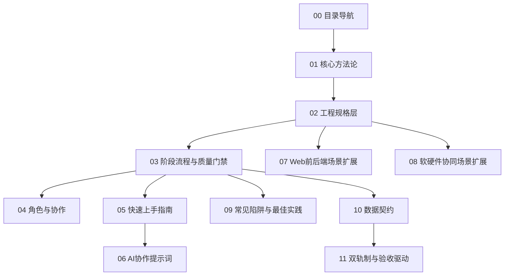

# 00-目录导航

> 本文档帮助不同类型的用户选择阅读路径，避免一上来就陷入长篇方法论。

---

## 1. 文档分层

---

## 2. 按用户类型阅读

### 2.1 我只是想理解这套东西

阅读顺序：

1. `01-核心方法论.md`
2. `02-工程规格层.md`
3. `09-常见陷阱与最佳实践.md`

目标：理解为什么不能从 UI 设计稿直接跳到编码。

### 2.2 我要开始一个新项目

阅读顺序：

1. `01-核心方法论.md`
2. `02-工程规格层.md`
3. `03-阶段流程与质量门禁.md`
4. `05-快速上手指南.md`
5. `../templates/00-模板索引.md`

目标：从想法和界面设计生成工程规格。

### 2.3 我要让 AI 帮我写规格

阅读顺序：

1. `02-工程规格层.md`
2. `03-阶段流程与质量门禁.md`
3. `06-AI协作提示词.md`
4. `../templates/00-模板索引.md`

目标：用 AI 生成 PRD、数据字典、约束、接口、时序图、RTM。

### 2.4 我做的是 Web 前后端项目

阅读顺序：

1. `02-工程规格层.md`
2. `03-阶段流程与质量门禁.md`
3. `07-Web前后端场景扩展.md`
4. `../templates/00-模板索引.md`

重点：API 契约、数据库 Schema、认证授权、错误码、前后端共享类型。

### 2.5 我做的是软硬件协同项目

阅读顺序：

1. `02-工程规格层.md`
2. `03-阶段流程与质量门禁.md`
3. `08-软硬件协同场景扩展.md`
4. `../templates/00-模板索引.md`

重点：硬件清单、设备数据字典、通信契约、部署拓扑、异常恢复、现场验收。

---

## 3. 最小闭环

如果时间很紧，至少完成以下 7 个产物：

1. PRD 产品需求文档
2. 数据字典与 ER 图
3. 通用约束与业务规则
4. 接口/API/设备契约
5. 核心流程时序图
6. 需求追踪矩阵
7. 测试计划

这 7 个产物能让 AI 或开发团队知道：做什么、数据是什么、规则是什么、谁调用谁、如何验证。

---

## 4. 完整闭环

完整项目建议补齐：

1. PRD
2. 数据字典与 ER 图
3. 通用约束
4. 接口/API/设备契约
5. 4+1 架构视图
6. Mermaid 流程、时序、状态、类图
7. 需求追踪矩阵
8. 测试计划与验收报告
9. 硬件与部署清单
10. 变更日志与复盘

---

## 5. 判断文档是否够用

| 问题 | 如果答不上来，缺的文档 |
|------|------------------------|
| 这个功能做到什么程度算完成？ | PRD |
| 这个字段到底什么意思？ | 数据字典 |
| 多个模块都要遵守的规则在哪里？ | 通用约束 |
| 系统模块怎么分、部署在哪里？ | 4+1 架构视图 |
| 模块之间怎么调用？ | 接口契约 |
| 关键流程谁先谁后？ | 时序图 |
| 哪条需求实现了吗？ | RTM |
| 怎么证明没做错？ | 测试计划 |