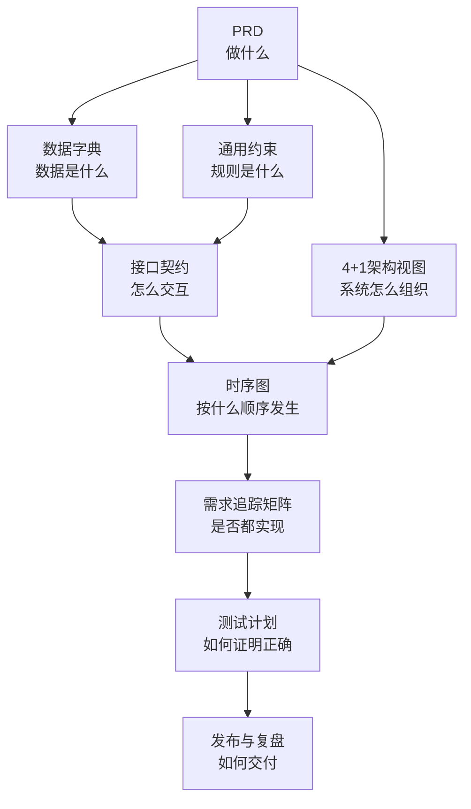

# 01-核心方法论

> InspireSpec 是把“设计资产”翻译成“工程规格”的方法论与模板体系。它不替代设计工具，也不直接生成代码，而是让开发、测试、部署和 AI 编码都有明确依据。

---

## 1. InspireSpec 解决什么问题

当一个项目已经有功能设计、页面流转、UI 设计稿和交互说明时，很多人会直接开始编码。但从设计稿到可靠软件之间仍缺一层工程规格：

| 缺口 | 典型表现 | 后果 |
|------|----------|------|
| PRD 不独立 | 需求散落在页面说明中 | 不知道验收到什么程度 |
| 数据关系不清 | 字段语义、实体关系靠猜 | 前端、后端、算法理解不一致 |
| 通用约束缺失 | 规则散落在代码和口头说明中 | 修一个模块破坏另一个模块 |
| 架构视图缺失 | 只知道页面，不知道系统如何运行 | 并发、部署、硬件边界后置爆雷 |
| 接口契约缺失 | 模块之间靠默契 | 联调成本高，AI 容易写偏 |
| 时序图缺失 | 关键流程谁先谁后不清楚 | 代码模块都有，但串不起来 |
| 追踪矩阵缺失 | 设计点没有实现/测试映射 | 功能遗漏、幽灵实现 |

InspireSpec 的核心目标：把这些“应该在编码前想清楚的事”变成有顺序、有模板、有门禁的产物。

---

## 2. 在三段式工具链中的位置

| 工具 | 输入 | 输出 | 解决的问题 |
|------|------|------|------------|
| InspireDesign | 模糊想法 | 功能蓝图、页面流转、设计令牌、组件库、界面稿 | 让非设计师能产出可交付设计 |
| InspireSpec | 设计资产 | PRD、数据字典、约束、架构视图、接口契约、时序图、RTM、测试计划 | 让设计能变成可实现规格 |
| InspireShip | 工程规格 | 代码、测试、部署包 | 让规格变成可运行软件 |

---

## 3. 核心主张

1. 代码可以重写，但工程纪律不能跳过。
2. AI 写代码越快，越需要规格来约束方向。
3. 人负责决策和验收，AI 负责提取、结构化和生成草案。
4. Markdown 与 Mermaid 是规格事实源，便于审查、版本管理和复用。
5. 每个阶段必须有出口条件，没有通过就不进入下一阶段。

---

## 4. 为什么这样设计（关键决策论证）

### 4.1 为什么 Markdown 是事实源，而不是 JSON 或数据库

| | Markdown | JSON / 数据库 | 专用工具（Confluence/Notion） |
|---|---|---|---|
| 可 diff | 能（Git 原生支持） | 能（但可读性差） | 不能（或很弱） |
| AI 可直接消费 | 能（文本即输入） | 能 | 不能（需要导出） |
| 人可直接阅读 | 能 | 能（但结构感弱） | 能 |
| 可版本管理 | 能（Git） | 能 | 弱（自带历史但不可分支） |
| 模板复用 | 能（复制文件） | 能 | 弱 |
| 可生成 Mermaid | 能（内嵌） | 不能（需额外工具） | 不能 |

**结论：Markdown 在可 diff、AI 可消费、人可读、版本管理四个维度上都是最优解。** JSON 适合机器间传输，但不适合人直接编写和审查；专用工具在协作上有优势，但在 AI 消费和版本管理上受限。

### 4.2 为什么是 A-G 这 7 个阶段，而不是 5 个或 10 个

阶段划分的依据是**信息依赖关系**：每个阶段的产物是下一个阶段的输入，跳过任何阶段都会导致下游信息缺失。

| 如果只有 5 个阶段 | 会丢失什么 |
|---|---|
| 合并 A+B（需求+数据） | PRD 和数据结构混在一起，业务语义和数据语义互相干扰 |
| 合并 C+D（契约+架构） | 接口定义和架构视图混在一起，模块边界和系统边界分不清 |
| 砍掉 G（复盘） | 经验无法沉淀，同类问题反复出现 |

| 如果拆成 10 个阶段 | 会多出什么 |
|---|---|
| 拆分 E（编码）为多阶段 | 编码是执行动作，不是规格定义——InspireSpec 的职责到"指导编码"为止，不进入编码本身 |
| 拆分 F（测试）为多阶段 | 测试策略和测试执行可以分，但在"一人+AI"模式下过度拆分反而增加管理负担 |

**结论：A-G 是信息依赖链上的最小完备划分——每个阶段都有不可替代的信息产物，合并不丢信息，拆不多价值。**

### 4.3 为什么 E-G 可以写得比 A-D 简略（在方法论层面）

这不是因为 E-G 不重要，而是因为：

- **A-D 是规格定义阶段**：需要精确的模板、字段定义、门禁条件——因为规格的错误成本最高（下游全部受影响）
- **E-G 是执行与验证阶段**：更多依赖具体项目的技术栈和工具链，方法论能提供的通用指导相对有限
- **E-G 的详细程度因项目而异**：一个纯 Web API 项目的 E 阶段和一个软硬件协同项目的 E 阶段，操作细节完全不同

但这不意味着 E-G 没有方法论价值。在 [03-阶段流程与质量门禁.md](./03-阶段流程与质量门禁.md) 中，E-G 与 A-D 采用相同的完整字段定义（目标/产物/出口条件/依赖/规则/AI引导/坑/回退影响面/人确认点）。

### 4.4 为什么角色分工是"AI 提取，人裁定"

| | AI 全权 | 人全权 | AI 提取 + 人裁定（选定） |
|---|---|---|---|
| 速度 | 快，但容易偏离业务 | 慢，且人不一定有精力 | 中等，但方向正确 |
| 准确性 | 结构化强，但业务语义可能错 | 准确，但提取工作量大 | AI 擅长提取，人擅长裁定 |
| 可审查性 | AI 产出可审查 | 人脑决策不可审查 | AI 产出可审查，人决策有记录 |

**结论：AI 的强项是“从散乱材料中提取结构化信息”，人的强项是“业务裁定和风险取舍”。把两者分开，各做各擅长的事。**

---

## 5. InspireSpec 的 A-G 阶段

| 阶段 | 名称 | 核心产物 | 解决的问题 |
|------|------|----------|------------|
| A | 设计接收、PRD 与差距分析 | 设计资产清单、PRD、差距报告 | 需求范围和验收口径不清 |
| B | 数据建模与通用约束 | 数据字典、ER 图、业务规则 | 数据语义和跨模块规则不一致 |
| C | 接口契约、状态机与核心时序 | 接口/API/设备契约、状态图、时序图 | 模块协作和流程不清 |
| D | 4+1 视图与实现规划 | 架构视图、RTM、任务清单 | 系统边界和实现顺序不清 |
| E | 编码实现与单元测试 | 代码、单元测试、变更日志 | 实现不受规格约束 |
| F | 集成测试与回归验证 | 测试报告、缺陷清单 | 无法证明实现符合设计 |
| G | 发布准备与复盘 | 发布清单、复盘报告 | 部署和经验无法闭环 |

---

## 6. 由总及分的文档关系

---

## 7. 最终判断标准

一套 InspireSpec 规格是否合格，不看文档页数，而看它是否能回答：

- 需求边界是否明确？
- 数据语义是否唯一？
- 业务规则是否集中？
- 模块边界是否清楚？
- 关键流程是否可视化？
- 每条需求是否可追踪？
- 每个核心规则是否可测试？
- 软件、硬件和部署条件是否提前暴露？