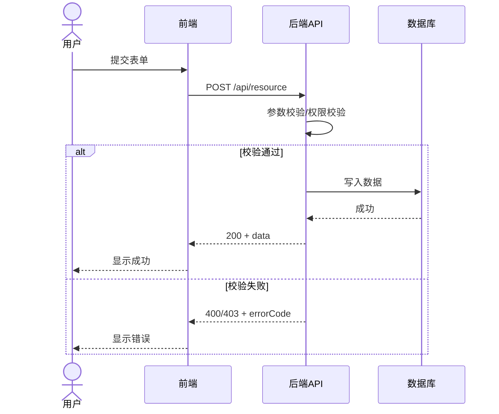
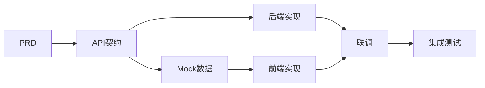

# 07-Web前后端场景扩展

> Web 前后端分离项目在通用 InspireSpec 流程之外，必须强化 API 契约、数据库 Schema、认证授权、错误码和前后端共享类型。

---

## 1. Web 项目额外产物

| 产物 | 是否必须 | 作用 |
|------|----------|------|
| API 契约 | 必须 | 前后端并行开发和联调的事实源 |
| 数据库 Schema | 必须 | 后端数据持久化与迁移依据 |
| 认证授权方案 | 必须 | 定义登录态、权限、资源访问边界 |
| 错误码规范 | 建议 | 前端统一提示和异常处理 |
| 前端组件规格 | 建议 | Props、State、Events 与设计稿一致 |
| 共享类型 | 建议 | DTO/VO/TypeScript interface 一致 |
| Mock 策略 | 建议 | 前端可在后端完成前开发 |

---

## 2. API 契约最小字段

| 字段 | 说明 |
|------|------|
| 方法 | GET / POST / PUT / DELETE |
| 路径 | `/api/v1/resource` |
| 认证 | 是否需要登录 |
| 权限 | 角色、资源、操作 |
| 请求参数 | path/query/header/body |
| 响应体 | 成功和失败结构 |
| 错误码 | 业务码、HTTP 状态码、前端处理 |
| 幂等性 | 是否允许重试，幂等键是什么 |
| 副作用 | 是否写库、发消息、调用第三方 |

---

## 3. 数据库 Schema 要点

- 每张表必须说明业务含义。
- 每列必须说明类型、约束、默认值、是否可空。
- 索引必须说明查询场景。
- 关联关系必须与数据字典一致。
- 数据库迁移必须可追踪、可回滚。

---

## 4. 认证授权要点

| 项 | 说明 |
|----|------|
| 登录方式 | JWT / Session / OAuth / SSO |
| Token 生命周期 | 过期、刷新、吊销 |
| 权限模型 | RBAC / ABAC / 资源拥有者 |
| 前端处理 | 未登录、无权限、Token 过期 |
| 后端处理 | 鉴权中间件、审计日志 |

---

## 5. Web 项目的 Mermaid 图

### 5.1 API 调用时序

### 5.2 前后端联调流程

---

## 6. Web 场景质量门禁

- [ ] 每个页面操作都有 API 或本地状态来源。
- [ ] 每个 API 有请求、响应、错误码和权限说明。
- [ ] 数据库表与数据字典一致。
- [ ] 前端类型与后端 DTO 一致。
- [ ] 认证过期、无权限、参数错误有统一处理。
- [ ] Mock 数据与真实 API 契约一致。
- [ ] API 变更同步 RTM、测试和变更日志。