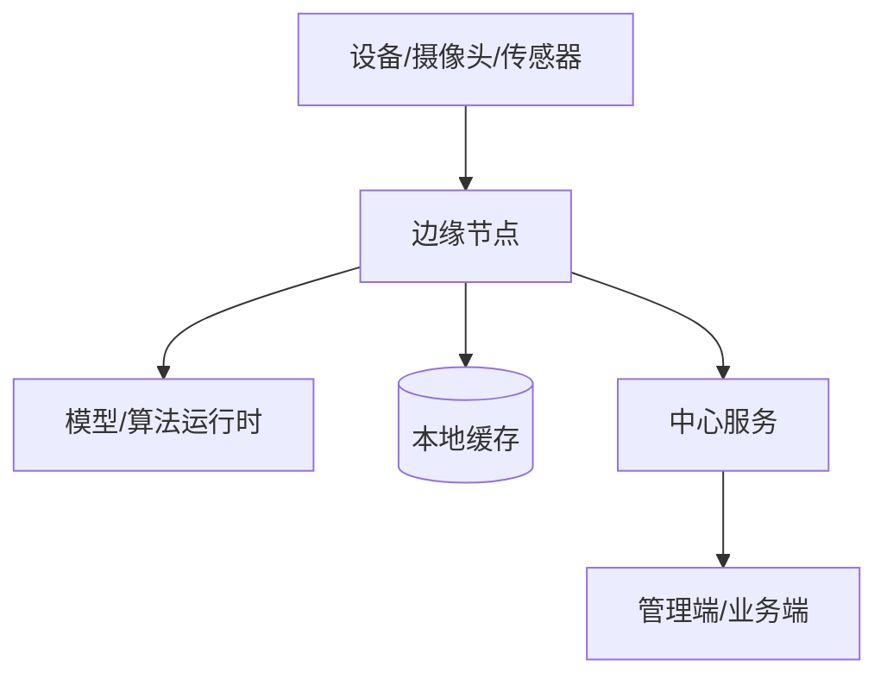
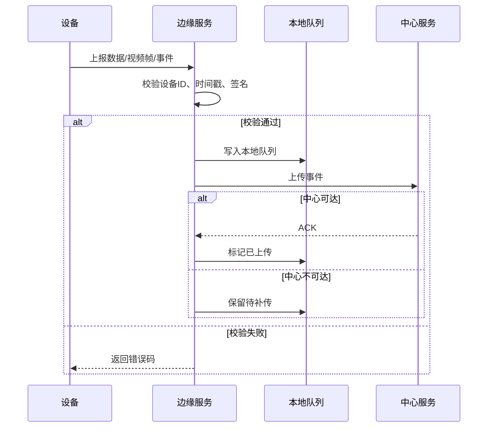

# 08-软硬件协同场景扩展

> 软硬件协同项目必须把设备、驱动、通信、部署、异常恢复前置到规格层，不能等到现场联调时再补。

---

## 1. 适用场景

- 摄像头、RTSP、视频流。
- 边缘服务器、GPU、NPU、AI 推理盒。
- 传感器、PLC、串口设备、工控机。
- 门禁、闸机、报警器、机器人、无人机。
- 需要现场部署、断网恢复、设备维护的项目。

---

## 2. 额外规格产物

| 产物 | 内容 | 对应通用阶段 |
|------|------|--------------|
| 硬件清单 | 型号、厂商、固件、驱动、接口、供电、网络 | A/D/G |
| 设备数据字典 | 上报字段、单位、范围、采样周期、精度 | B |
| 设备状态机 | 在线、离线、故障、恢复、升级、维护 | C |
| 通信契约 | 协议、端口、认证、心跳、超时、重试、幂等 | C |
| 部署拓扑 | 终端、边缘、中心、设备、网络、存储 | D/G |
| 异常策略 | 断网、断电、离线、时间漂移、缓存堆积 | B/C/F |
| 现场验收清单 | 设备连通、压力、恢复、回滚 | F/G |

---

## 3. 物理视图必须回答

| 问题 | 必须有答案 |
|------|------------|
| 设备接在哪里？ | IP、端口、串口、USB、SDK |
| 数据怎么来？ | 推送、拉取、流式、轮询 |
| 掉线怎么判断？ | 心跳周期、超时阈值 |
| 掉线后怎么办？ | 本地缓存、重连、补传、告警 |
| 算法跑在哪里？ | 设备端、边缘端、中心端 |
| 模型依赖什么？ | CPU/GPU/NPU、驱动、运行库 |
| 现场怎么验收？ | 检查命令、样例数据、测试步骤 |

---

## 4. 通信契约必须回答

| 项 | 说明 |
|----|------|
| 协议 | HTTP/TCP/UDP/RTSP/Modbus/串口/厂商 SDK |
| 地址 | IP、端口、路径、设备 ID |
| 鉴权 | Token、签名、证书、白名单、设备密钥 |
| 数据格式 | JSON、二进制、帧格式、字段单位 |
| 时间 | 时间戳、时区、NTP、漂移容忍 |
| 心跳 | 周期、超时、离线判定 |
| 重试 | 次数、间隔、退避、幂等键 |
| 缓存 | 离线缓存容量、补传策略 |
| 错误码 | 设备错误、网络错误、业务错误 |

---

## 5. 推荐时序图

---

## 6. 现场验收建议

1. 先用模拟设备验证通信契约。
2. 再用单台真实设备验证数据格式和状态机。
3. 再做多设备并发和长时间稳定性测试。
4. 再做断网、断电、设备离线、服务重启恢复测试。
5. 最后按硬件与部署清单逐项验收。

---

## 7. 软硬件场景质量门禁

- [ ] 硬件型号、固件、驱动、接口已明确。
- [ ] 设备数据字段有单位、范围、采样周期。
- [ ] 通信契约有心跳、超时、重试、幂等。
- [ ] 设备状态机包含离线、故障、恢复。
- [ ] 物理视图包含设备、边缘、中心和网络。
- [ ] 现场验收清单包含异常恢复测试。