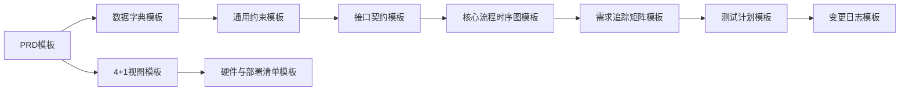

# 00-模板索引

> 本索引说明模板与阶段、用途、产物之间的对应关系。正式模板均位于当前 `templates/` 目录。

---

## 1. 通用模板

| 阶段 | 模板 | 用途 | 模板路径 |
|------|------|------|----------|
| A | PRD 产品需求模板 | 定义业务目标、范围、需求、验收标准 | `./PRD产品需求模板.md` |
| B | 数据字典模板 | 定义实体、字段、枚举、ER 图 | `./数据字典模板.md` |
| B-C | 通用约束与业务规则模板 | 集中管理跨模块规则和不变量 | `./通用约束与业务规则模板.md` |
| C | 接口契约模板 | 定义模块/API/设备输入输出 | `./接口契约模板.md` |
| C-D | 核心流程时序图模板 | 用 Mermaid 固化流程、异常、状态 | `./核心流程时序图模板.md` |
| D | 架构4+1视图模板 | 梳理用例、逻辑、开发、进程、物理视图 | `./架构4+1视图模板.md` |
| D | 需求追踪矩阵模板 | 建立需求→设计→实现→测试映射 | `./需求追踪矩阵模板.md` |
| D-F | 测试计划模板 | 定义正常、边界、异常、回归测试 | `./测试计划模板.md` |
| F-G | 硬件与部署清单模板 | 记录环境、设备、网络、模型、验收 | `./硬件与部署清单模板.md` |
| E-G | 变更日志模板 | 记录改动、原因、影响面 | `./变更日志模板.md` |

---

## 2. 推荐生成顺序

---

## 3. 按项目类型选择

### 3.1 桌面端/单体应用

必选：

- PRD 产品需求模板
- 数据字典模板
- 通用约束与业务规则模板
- 接口契约模板
- 核心流程时序图模板
- 需求追踪矩阵模板
- 测试计划模板
- 变更日志模板

按需：

- 架构4+1视图模板
- 硬件与部署清单模板

### 3.2 Web 前后端项目

必选：

- PRD 产品需求模板
- 数据字典模板
- 通用约束与业务规则模板
- 接口契约模板
- 架构4+1视图模板
- 核心流程时序图模板
- 需求追踪矩阵模板
- 测试计划模板

额外关注：

- API 契约
- 数据库 Schema
- 认证授权
- 错误码
- 前后端共享类型

### 3.3 软硬件协同项目

必选：

- PRD 产品需求模板
- 数据字典模板
- 通用约束与业务规则模板
- 架构4+1视图模板
- 接口契约模板
- 核心流程时序图模板
- 硬件与部署清单模板
- 测试计划模板

额外关注：

- 设备数据字典
- 设备状态机
- 通信契约
- 部署拓扑
- 现场验收清单

---

## 4. 模板使用原则

- 模板是结构，不是答案。
- 项目特定规则不要写回通用模板。
- 每个模板都应有“上游来源”和“下游影响”。
- P0/P1 规则必须进入测试计划。
- Mermaid 图表源码应保存在 Markdown 中，方便审查和版本管理。