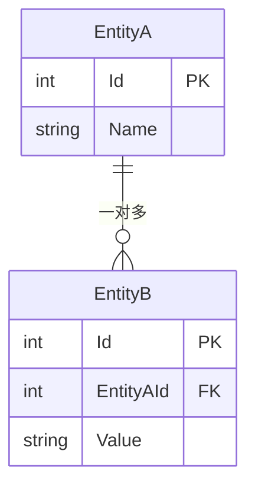

# 数据字典

> **使用说明**：为系统中每个数据实体填写一份下表。所有字段必须有明确的类型、约束和语义说明。
> 状态字段必须定义枚举（不要用 string）。ER 图用 Mermaid erDiagram 语法。

---

## 实体：[实体名称]

**一句话说明**：[这个实体代表什么]

| 字段 | 类型 | 约束 | 默认值 | 语义 |
|------|------|------|--------|------|
| Id | int | PK, 自增 | — | 唯一标识 |
| ... | ... | ... | ... | ... |

### 关联关系

### 状态枚举：[枚举名称]

| 值 | 含义 | 进入条件 | 可转换到 |
|----|------|---------|---------|
| Value1 | 说明 | 初始状态 / 触发条件 | Value2, Value3 |
| Value2 | 说明 | 触发条件 | 终态 / Value1 |

### 约束与不变量

- [约束1：如 "Confidence 必须在 0~1 之间"]
- [约束2：如 "Category 不能为空"]
- [约束3：如 "SortStatus=已复制 时 TargetPath 不能为空"]

---

<!-- 复制上面的"实体"区块，为每个实体重复填写 -->

## 检查清单

- [ ] 每个实体都有完整的字段表
- [ ] 每个状态字段都有枚举定义（不是 string）
- [ ] 枚举的每个值都有进入条件和可转换目标
- [ ] ER 图已绘制，关系已标注
- [ ] 代码中的数据类与字典一致（字段名、类型、约束）
- [ ] 约束与不变量已列出
