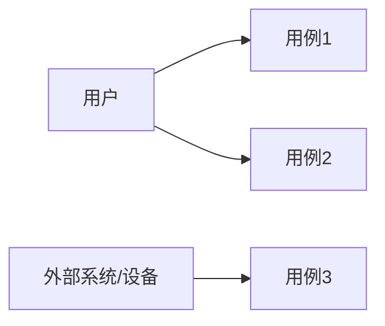
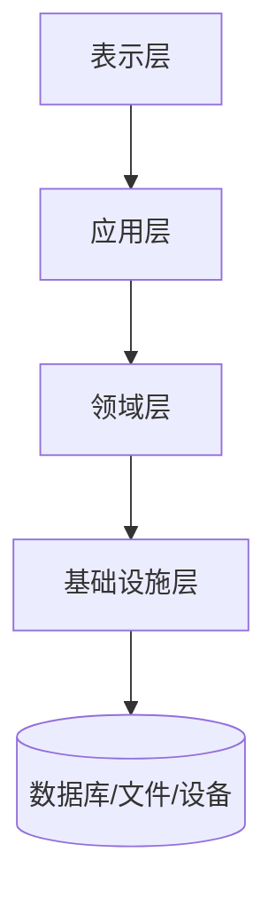
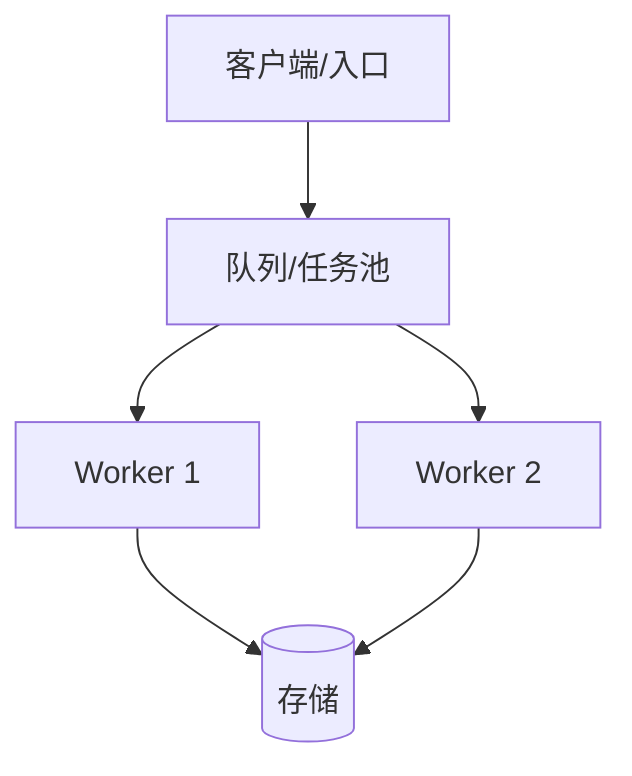
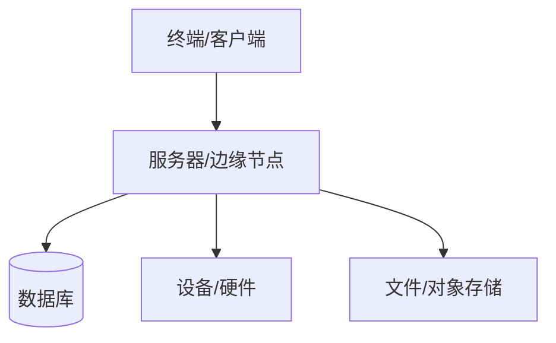

# [项目名] 架构 4+1 视图

| 文档属性 | 值 |
|---------|-----|
| 项目 | [项目名] |
| 版本 | v0.1 |
| 定位 | 用例、逻辑、开发、进程、物理五个视角的系统架构说明 |
| 上游来源 | PRD / 数据字典 / 通用约束 / 技术选型 |
| 下游影响 | 接口契约 / 时序图 / 测试计划 / 部署方案 |

> 4+1 视图用于把一个系统从“用户怎么用、模块怎么分、代码怎么放、运行怎么协作、部署在哪里”五个角度讲清楚。

---

## 1. +1 用例视图

### 1.1 参与者

| 参与者 | 目标 | 关键权限/限制 |
|--------|------|----------------|
| [用户/外部系统/设备] | [目标] | [权限/限制] |

### 1.2 用例图

### 1.3 关键场景

| 场景 | 目标 | 成功标准 | 异常场景 |
|------|------|----------|----------|
| [场景] | [目标] | [标准] | [异常] |

---

## 2. 逻辑视图

| 模块 | 职责 | 输入 | 输出 | 关键约束 |
|------|------|------|------|----------|
| [模块] | [职责] | [输入] | [输出] | [约束] |

---

## 3. 开发视图

| 工程/包/模块 | 类型 | 职责 | 依赖 | 禁止事项 |
|---------------|------|------|------|----------|
| [模块] | [应用/库/服务/工具] | [职责] | [依赖] | [禁止] |

---

## 4. 进程视图

| 运行单元 | 类型 | 生命周期 | 并发/队列 | 失败处理 |
|----------|------|----------|-----------|----------|
| [进程/线程/任务] | [类型] | [启动/停止] | [策略] | [策略] |

---

## 5. 物理视图

| 节点/设备 | 部署内容 | 依赖 | 网络/端口 | 运维检查 |
|-----------|----------|------|-----------|----------|
| [节点] | [服务/程序] | [依赖] | [端口] | [检查命令/方法] |

---

## 6. 视图一致性检查

- [ ] 每个用例都有逻辑模块承接。
- [ ] 每个核心模块都有接口契约。
- [ ] 每个工程/包的依赖方向合理。
- [ ] 每个长耗时/并发流程在进程视图中可解释。
- [ ] 每个部署依赖在物理视图中可定位。
- [ ] 每个关键场景至少有一张时序图。