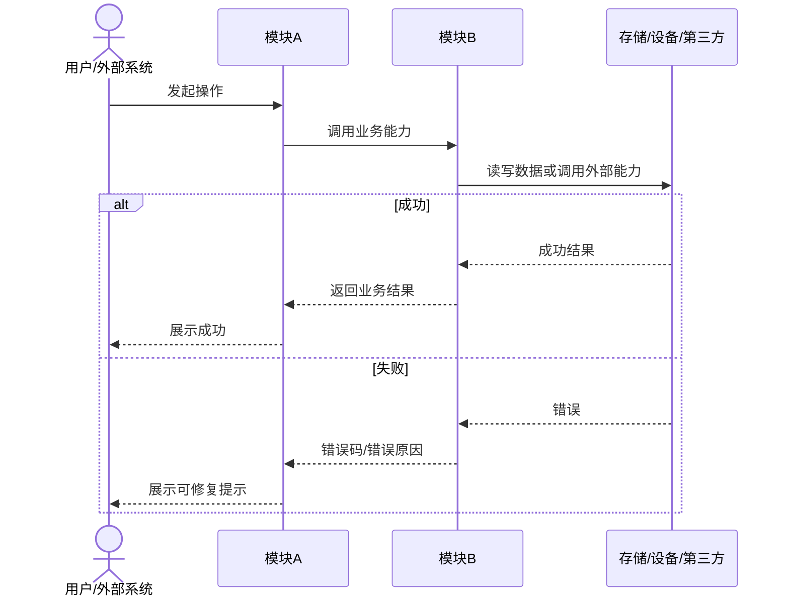
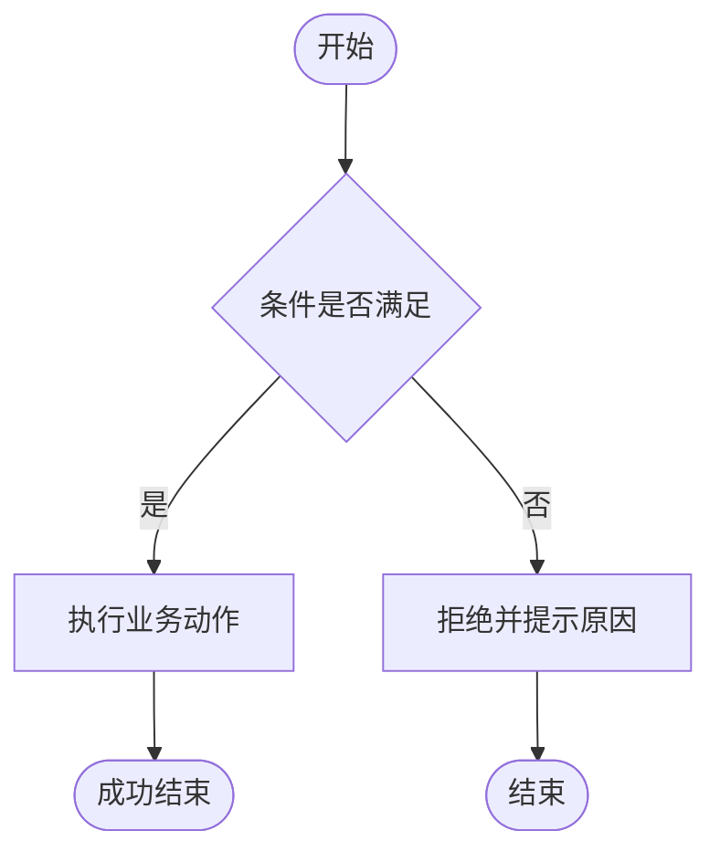
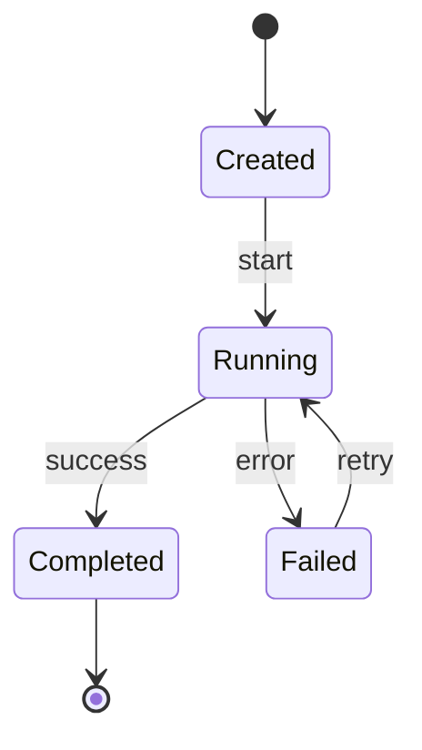
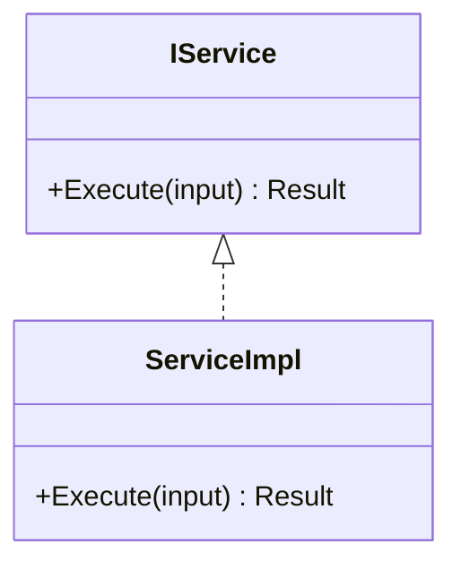

# [项目名] 核心流程时序图

| 文档属性 | 值 |
|---------|-----|
| 项目 | [项目名] |
| 版本 | v0.1 |
| 定位 | 用 Mermaid 固化关键业务流程、模块交互、异常路径与状态变化 |
| 上游来源 | PRD / 通用约束 / 接口契约 / 4+1视图 |
| 下游影响 | 编码实现 / 联调 / 测试计划 / 回归验证 |

> 时序图回答“谁先调用谁、数据在哪里变化、异常在哪里处理”。

---

## 1. 图表清单

| 编号 | 流程 | 类型 | 覆盖范围 | 状态 |
|------|------|------|----------|------|
| SEQ-001 | [流程名] | sequenceDiagram | 正常路径/异常路径 | 草稿/已确认 |
| FLOW-001 | [流程名] | flowchart | 业务分支/决策 | 草稿/已确认 |
| STATE-001 | [对象名] | stateDiagram-v2 | 状态转换 | 草稿/已确认 |

---

## 2. 核心流程时序图模板

### 2.1 说明

| 项 | 内容 |
|----|------|
| 触发条件 | [用户操作/定时任务/设备事件/API调用] |
| 前置条件 | [登录、配置、资源、硬件在线等] |
| 成功结果 | [最终状态/输出数据/副作用] |
| 异常路径 | [超时、权限、参数、设备离线、写入失败等] |
| 相关规则 | [RULE-xxx] |
| 相关接口 | [接口契约章节] |
| 验收用例 | [测试编号] |

---

## 3. 业务流程图模板

---

## 4. 状态机图模板

### 4.1 状态说明

| 状态 | 含义 | 进入条件 | 可转换目标 | 禁止转换 |
|------|------|----------|------------|----------|
| Created | [含义] | [条件] | Running | Completed |

---

## 5. 类/模块图模板

---

## 6. 图表质量门禁

- [ ] 每张图有编号和适用场景。
- [ ] 主链路和至少一个异常路径都被表达。
- [ ] 图中的模块名与接口契约一致。
- [ ] 图中的数据对象与数据字典一致。
- [ ] 图中的规则编号能在通用约束中找到。
- [ ] 图表源码保存在 Markdown 中，便于版本管理。