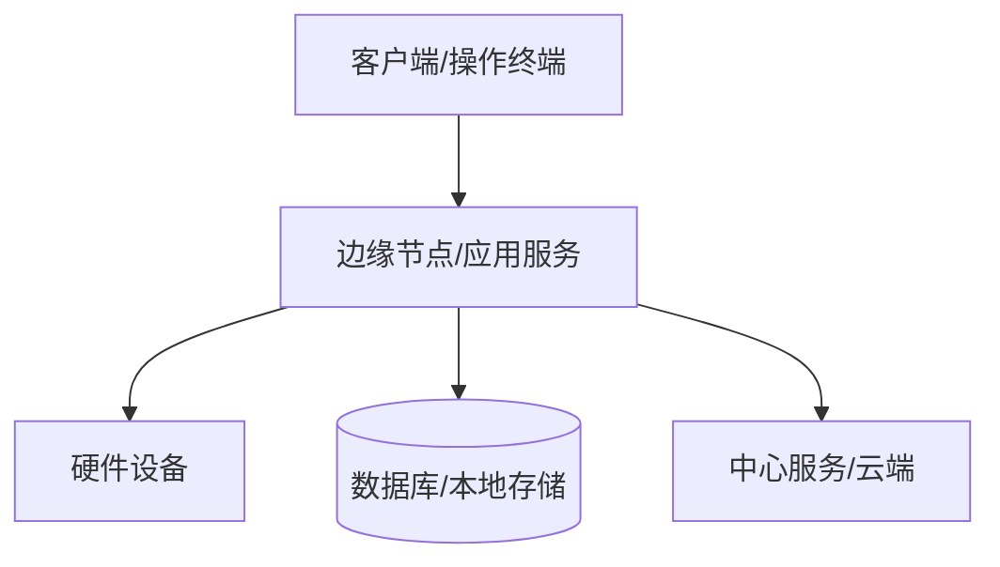

# [项目名] 硬件与部署清单

| 文档属性 | 值 |
|---------|-----|
| 项目 | [项目名] |
| 版本 | v0.1 |
| 定位 | 记录系统运行所需的软件、硬件、网络、模型、配置和现场验收条件 |
| 上游来源 | PRD / 4+1物理视图 / 接口契约 |
| 下游影响 | 部署脚本 / 运维手册 / 测试计划 / 交付验收 |

---

## 1. 部署拓扑

---

## 2. 软件依赖清单

| 组件 | 版本 | 用途 | 安装位置 | 检查方法 | 缺失处理 |
|------|------|------|----------|----------|----------|
| [运行时/数据库/驱动] | [版本] | [用途] | [路径/节点] | [命令/界面] | [处理方式] |

---

## 3. 硬件清单

| 设备 | 型号 | 厂商 | 固件/驱动 | 接口 | 供电/网络 | 备注 |
|------|------|------|-----------|------|-----------|------|
| [设备] | [型号] | [厂商] | [版本] | [USB/网口/串口/RTSP] | [要求] | [备注] |

---

## 4. 网络与端口

| 节点 | 协议 | 地址/端口 | 方向 | 用途 | 防火墙要求 |
|------|------|-----------|------|------|------------|
| [节点] | HTTP/TCP/UDP/RTSP | [地址] | 入站/出站 | [用途] | [要求] |

---

## 5. 配置文件与密钥

| 文件/配置项 | 路径 | 用途 | 是否敏感 | 更新方式 | 备份策略 |
|-------------|------|------|----------|----------|----------|
| [配置] | [路径] | [用途] | 是/否 | [方式] | [策略] |

---

## 6. 模型/算法资源

| 资源 | 版本 | 格式 | 加载位置 | 兼容硬件 | 验证方法 |
|------|------|------|----------|----------|----------|
| [模型] | [版本] | ONNX/PT/OM/其他 | [路径] | CPU/GPU/NPU | [测试样例] |

---

## 7. 现场验收清单

| 编号 | 验收项 | 方法 | 通过标准 | 结果 |
|------|--------|------|----------|------|
| DEP-001 | 环境依赖检查 | [命令/操作] | [标准] | 待测/通过/失败 |
| DEP-002 | 设备连通性 | [命令/操作] | [标准] | 待测/通过/失败 |
| DEP-003 | 主流程验证 | [步骤] | [标准] | 待测/通过/失败 |
| DEP-004 | 异常恢复 | [断网/重启/断电] | [标准] | 待测/通过/失败 |

---

## 8. 回滚方案

| 场景 | 回滚动作 | 数据影响 | 负责人 |
|------|----------|----------|--------|
| [失败场景] | [回滚步骤] | [影响] | [角色] |